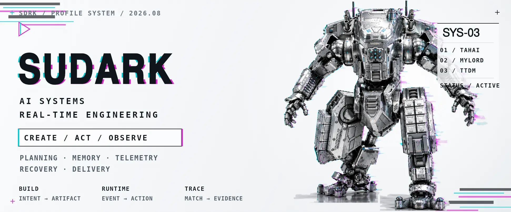
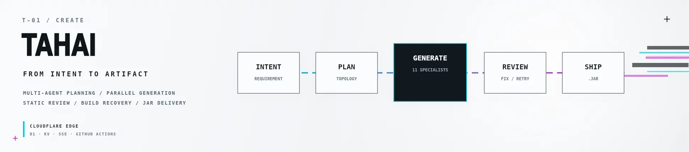
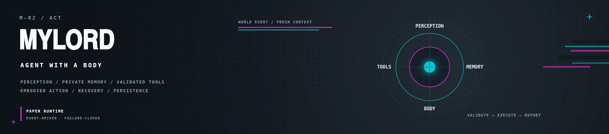
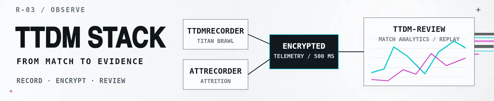

  

  <a href="https://github.com/superwfox/minecraft-dev"><b>TAHAI</b></a>
  &nbsp;&nbsp;/&nbsp;&nbsp;
  <a href="https://github.com/superwfox/MyLord"><b>MYLORD</b></a>
  &nbsp;&nbsp;/&nbsp;&nbsp;
  <a href="https://github.com/superwfox/TTDMRecorder"><b>TTDM STACK</b></a>
   
  CREATE &nbsp;/&nbsp; ACT &nbsp;/&nbsp; OBSERVE

---

### `T-01 / CREATE` · [TAHAI](https://github.com/superwfox/minecraft-dev)

**From intent to artifact.** Multi-agent planning, parallel generation, static review, build recovery, and JAR delivery.

`Cloudflare Workers` · `D1` · `KV` · `SSE` · `GitHub Actions`

---

### `M-02 / ACT` · [MyLord](https://github.com/superwfox/MyLord)

**Agent with a body.** Perception, private memory, validated tools, embodied action, recovery, and persistence.

`event-driven` · `failure-closed`

---

### `R-03 / OBSERVE` · TTDM Stack

**From match to evidence.** TTDMRecorder and ATTRecorder feed encrypted telemetry into ttdm-review for metrics, timelines, match replay, and review.

[**TTDMRecorder**](https://github.com/superwfox/TTDMRecorder) · [**ATTRecorder**](https://github.com/superwfox/ATTRecorder) → [**ttdm-review**](https://ttdm.space)

---

  

### AI 还是实干？

> **AI 多一些，时代所赐。**  
> 能不能跑起来，仍由实干裁决。

  <a href="https://github.com/superwfox?tab=repositories">Projects</a>
  &nbsp;·&nbsp;
  <a href="mailto:2963502563@qq.com">Email</a>

