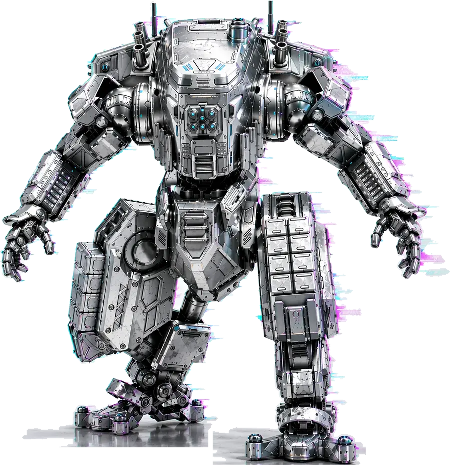
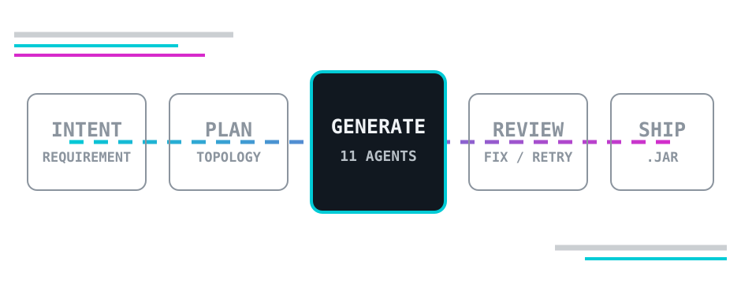
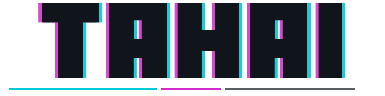
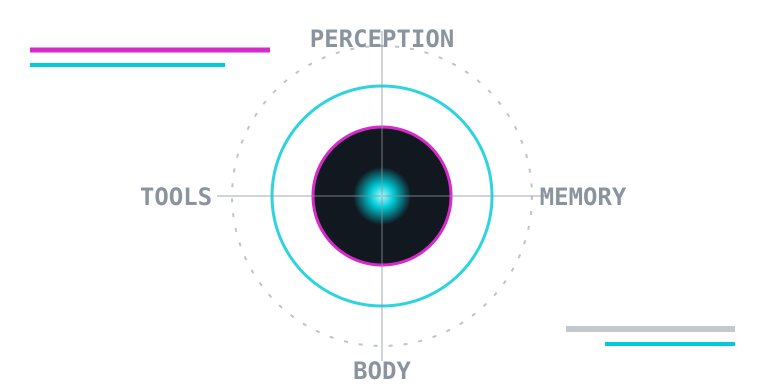
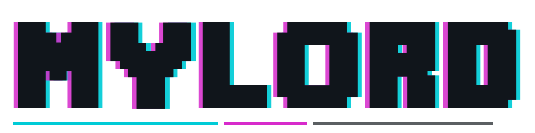
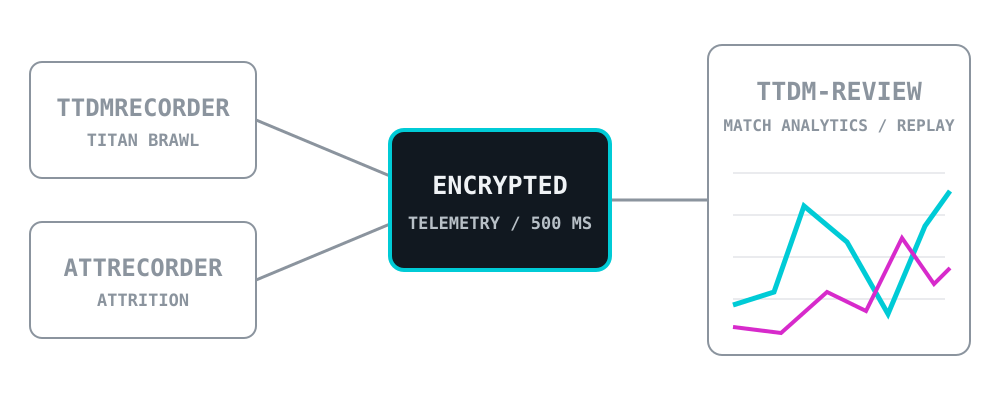
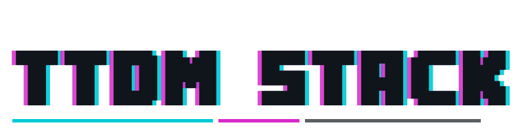

  <strong>EN</strong>
  &nbsp;/&nbsp;
  <a href="./README.zh-CN.md">中文</a>

<picture>
  <source media="(prefers-color-scheme: dark)" srcset="./assets/wordmark-dark.svg" />
  <source media="(prefers-color-scheme: light)" srcset="./assets/wordmark-light.svg" />
  
</picture>

## AI SYSTEMS
## REAL-TIME ENGINEERING

**CREATE / ACT / OBSERVE**

Planning · Memory · Telemetry  
Recovery · Delivery

[**TAHAI**](https://github.com/superwfox/minecraft-dev) &nbsp;/&nbsp; [**MYLORD**](https://github.com/superwfox/MyLord) &nbsp;/&nbsp; [**TTDM STACK**](https://github.com/superwfox/TTDMRecorder)

 

---

`T-01 / CREATE`

<picture>
  <source media="(prefers-color-scheme: dark)" srcset="./assets/title-tahai-dark.svg" />
  <source media="(prefers-color-scheme: light)" srcset="./assets/title-tahai-light.svg" />
  
</picture>

### From intent to artifact.

Multi-agent planning, parallel generation, static review, build recovery, and JAR delivery.

`Cloudflare Workers` · `D1` · `KV` · `SSE` · `GitHub Actions`

[**Repository →**](https://github.com/superwfox/minecraft-dev)

 

---

`M-02 / ACT`

<picture>
  <source media="(prefers-color-scheme: dark)" srcset="./assets/title-mylord-dark.svg" />
  <source media="(prefers-color-scheme: light)" srcset="./assets/title-mylord-light.svg" />
  
</picture>

### Agent with a body.

Perception, private memory, validated tools, embodied action, recovery, and persistence.

`event-driven` · `failure-closed`

[**Repository →**](https://github.com/superwfox/MyLord)

 

---

`R-03 / OBSERVE`

<picture>
  <source media="(prefers-color-scheme: dark)" srcset="./assets/title-ttdm-dark.svg" />
  <source media="(prefers-color-scheme: light)" srcset="./assets/title-ttdm-light.svg" />
  
</picture>

### From match to evidence.

TTDMRecorder and ATTRecorder feed encrypted telemetry into ttdm-review for metrics, timelines, match replay, and review.

[**TTDMRecorder**](https://github.com/superwfox/TTDMRecorder) · [**ATTRecorder**](https://github.com/superwfox/ATTRecorder) → [**ttdm-review**](https://ttdm.space)

 

---

## Q/A

### AI 还是实干？

> **AI 多一些，时代所赐。**  
> 能不能跑起来，仍由实干裁决。

---

## OPEN TO WORK

`STATUS / OPEN` · `BASE / WUHAN, CN`

Currently working in **Wuhan, China** and open to new opportunities.

  <a href="https://github.com/superwfox?tab=repositories">Projects</a>
  &nbsp;·&nbsp;
  <a href="mailto:2963502563@qq.com">Email</a>

